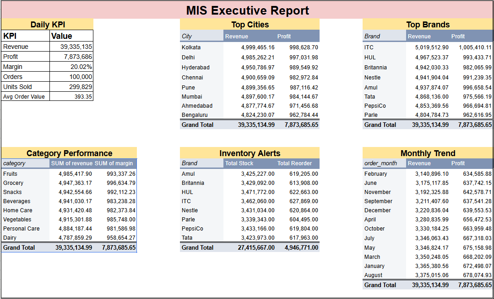

# FMCG Sales, Inventory & Customer Analytics Dashboard

## Project Overview
This project analyzes FMCG retail sales data to evaluate business performance across products, brands, cities, customers, sales channels, and inventory operations. The objective was to transform raw transactional data into actionable business insights using PostgreSQL and Power BI.

The project demonstrates an end-to-end analytics workflow including data preparation, SQL-based business analysis, dashboard development, and executive reporting.

---

## Business Problem

The FMCG company wanted to:

Monitor revenue and profitability

Track inventory risks and reorder requirements

Understand customer purchasing behavior

Compare performance across cities and channels

Support management decision-making using data

---

## Tools & Technologies

- PostgreSQL
- SQL
- Power BI
- Excel / CSV
- GitHub

---

## Dataset Information

- 8 Cities
- 100,000 FMCG Transactions
- 8 Product Categories
- 8 Brands
- 3 Sales Channels
- Jan 2024 – Dec 2024

---

## SQL Analysis Performed

# Category Profitability Analysis

- Revenue by category
- Profit by category
- Margin comparison

# Brand Performance Analysis

- Revenue ranking
- Profit contribution
- Margin analysis

# Customer Analytics

- Loyal vs Regular customers
- Revenue contribution
- Average bill value comparison

# City Performance Analysis

- Revenue by city
- Profit by city
- Geographic performance comparison

# Channel Analysis

- Online vs Offline vs Omnichannel performance

# Inventory Risk Analysis

- Products below reorder level
- Stock deficit evaluation
- Replenishment priorities

# Monthly Trend Analysis

- Revenue trends
- Profit trends
- Order volume trends

# Pareto Analysis

- Brand revenue contribution
- Revenue concentration assessment

---

## Dashboard Features

Page 1 – Executive Overview
## 📸 Dashboard Preview

# KPIs:

Total Revenue
Total Profit
Profit Margin %

# Visuals:

Monthly Revenue Trend
Revenue by City
Revenue by Payment Mode
Inventory Status Table

# Filters:

Brand
City
Category
Channel
Month

Page 2 – Business Insights & Action Center
## 📸 Dashboard Preview

# KPIs:

Top Brand
Top City
Best Channel
Highest Risk Category
Weakest Category

# Visuals:

Category Revenue & Profit Analysis
Brand Performance Ranking
Customer Revenue Contribution
Inventory Risk Analysis
Revenue by Channel

---

## Key Business Findings

# Revenue & Profitability

Total Revenue: 39.34M INR
Total Profit: 7.87M INR
Overall Profit Margin: 20.02%

# Category Analysis

Grocery generated the highest profit.
Dairy generated the lowest revenue.
Revenue contribution remained balanced across categories.

# Brand Analysis

ITC generated the highest revenue.
Amul achieved the highest profit margin.
Revenue distribution remained diversified across brands.

# Customer Analysis

Loyal customers contributed approximately 30% of revenue.
Average bill value was nearly identical between loyal and regular customers.
Loyalty program optimization opportunities were identified.

# Geographic Analysis

Kolkata was the highest-performing city.
Bengaluru generated the lowest revenue.
Profit margins remained consistent across all cities.

# Channel Analysis

Omnichannel generated the highest revenue.
Online, Offline, and Omnichannel channels contributed almost equally.

# Inventory Analysis

Dairy recorded the highest inventory risk.
Fruits showed the highest average stock deficit.
Replenishment planning opportunities were identified.

# Monthly Trend Analysis

August was the strongest month.
February was the weakest month.
Revenue remained stable throughout the year.

---
## MIS Report

## Business Recommendations

1. Improve loyalty program effectiveness through targeted rewards and personalized promotions.

2. Prioritize inventory replenishment for Dairy, Fruits, Snacks, Grocery, and Beverages.

3. Investigate low-performing segments such as Dairy and Bengaluru for growth opportunities.

4. Expand omnichannel initiatives to strengthen customer engagement and revenue generation.

---

# Skills Demonstrated

- SQL Querying
- Data Aggregation
- Window Functions
- Common Table Expressions (CTEs)
- Business Analytics
- KPI Development
- Dashboard Design
- Inventory Analytics
- Customer Analytics
- Executive Reporting
- Data Storytelling

---

# Project Outcome

Successfully transformed transactional FMCG sales data into a business intelligence solution that supports inventory planning, customer analysis, sales monitoring, and executive decision-making through SQL analysis and interactive Power BI dashboards.

## 🙌 Author
**Md Tanbir Rja**  
Aspiring Data Analyst / MIS_Executive\
Portfolio : https://tanbir-94.github.io/
